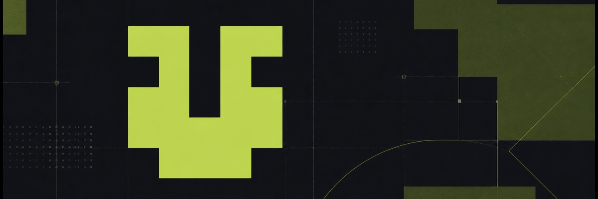

  
    
  
<strong>Practical tools for AI coding and macOS.</strong>

  
<samp>Built with AI. Shaped by everyday use.</samp>

  
<samp>
    <a href="https://quota-monitor.timmyagentic.com">Quota Monitor</a> ·
    <a href="https://github.com/timmyagentic/cc-connect-next">cc-connect-next</a> ·
    <a href="https://github.com/timmyagentic?tab=repositories">Projects</a> ·
    <a href="mailto:tzhou125@connect.hkust-gz.edu.cn">Email</a>
  </samp>

## Building

I turn problems I run into every day into tools I can use. Codex and Claude Code help me build; I take the work from finding the problem through testing, shipping, and maintenance.

- [**Quota Monitor**](https://github.com/timmyagentic/quota-monitor) — Codex and Claude Code quotas, reset times, and usage trends in your Mac menu bar. Built with SwiftUI. 
  [Website](https://quota-monitor.timmyagentic.com) · [Download](https://quota-monitor.timmyagentic.com/download)
- [**cc-connect-next**](https://github.com/timmyagentic/cc-connect-next) — Drive local coding agents from chat, with Feishu/Lark streaming cards and mid-turn steering on supported backends. An independent successor to CC Connect. 
  [Install](https://github.com/timmyagentic/cc-connect-next/blob/main/INSTALL.md) · [Feishu setup](https://github.com/timmyagentic/cc-connect-next/blob/main/docs/feishu.md)

## How I build

I care about the steps after code generation: a working install, verifiable results, useful feedback, and reliable updates. These repositories document the tools I ship, the problems I encounter, and the fixes that follow.

- [**AI Coding Prompt**](https://github.com/timmyagentic/ai-coding-prompt) — An earlier collection of prompts for architecture diagrams, sequence diagrams, and product documentation. A record of experiments.

## Earlier work

- [**MMF27 Dock Swipe Fix**](https://github.com/timmyagentic/mac-mouse-fix-macos-27-fix) — A legacy workaround for Mac Mouse Fix gestures on macOS 27. The original compatibility issue was fixed in official Mac Mouse Fix 3.1.0; use the official stable release. This repository preserves the earlier repair.
- [**Emomo**](https://github.com/timmyagentic/emomo) — A semantic meme-search experiment. This public repository is archived.
- [**CodexSpeed**](https://github.com/timmyagentic/codexspeed) — An archived experiment in measuring local model output speed.

---

Have feedback? Open an issue in the relevant project, or reach me by [email](mailto:tzhou125@connect.hkust-gz.edu.cn). English and Chinese welcome.

<samp>CS student @ HKUST(GZ) · prev. DJI / Tencent · Shenzhen</samp>

  <picture>
    <source media="(prefers-color-scheme: dark)" srcset="https://raw.githubusercontent.com/timmyagentic/timmyagentic/output/snake-dark.svg">
    
  </picture>

